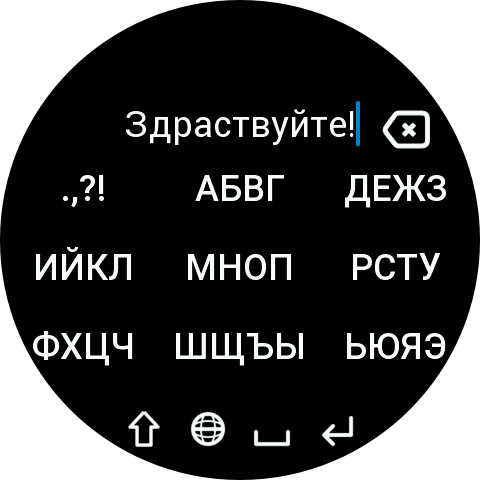

# T9 Russian Keyboard

Клавиатура с многократным нажатием клавиш (Multi-tap) для русского и английского языков на Zepp OS.

**T9 Russian Keyboard** позволяет вводить текст на совместимых устройствах Amazfit так же, как на классических кнопочных мобильных телефонах. Буквы распределены по 9 клавишам и выбираются последовательными нажатиями соответствующей клавиши.

Клавиатура поддерживает русский и английский языки, Shift, Caps Lock, цифры, специальные символы и переключение на другие методы ввода Zepp OS.

## Возможности

- 🇷🇺 Русская раскладка с многократным нажатием клавиш
- 🇬🇧 Английская раскладка с многократным нажатием клавиш
- Классический ввод текста с помощью 9 клавиш
- Shift для ввода одной заглавной буквы
- Caps Lock (активируется долгим нажатием кнопки Shift)
- Дополнительные символы (`.,?!/@₽-_`)
- Цифры от 0 до 9
- Быстрое переключение между русским и английским языками
- Доступ к другим установленным клавиатурам Zepp OS (долгое нажатие на значок глобуса)
- Изменение скорости ввода (долгое нажатие на значок X или ✓)
- Поддержка круглых и квадратных экранов

## Раскладка клавиатуры

### Русская

| Клавиша | Символы |
|---|---|
| 1 | . , ? ! |
| 2 | А Б В Г |
| 3 | Д Е Ж З |
| 4 | И Й К Л |
| 5 | М Н О П |
| 6 | Р С Т У |
| 7 | Ф Х Ц Ч |
| 8 | Ш Щ Ъ Ы |
| 9 | Ь Э Ю Я |
| 0 | Пробел (удержание) |

### Английская

| Клавиша | Символы |
|---|---|
| 1 | . , ? ! |
| 2 | A B C |
| 3 | D E F |
| 4 | G H I |
| 5 | J K L |
| 6 | M N O |
| 7 | P Q R S |
| 8 | T U V |
| 9 | W X Y Z |
| 0 | Пробел (удержание) |

Для выбора нужной буквы нажмите соответствующую клавишу несколько раз.

Например, на английской раскладке:

`2 → A → B → C`

Или на русской:

`2 → А → Б → В → Г`

## Shift и Caps Lock

**Короткое нажатие Shift**

Включает Shift для ввода следующего символа.

При использовании клавиши пунктуации Shift открывает дополнительные символы:

`@ ₽ - _`

**Долгое нажатие Shift**

Включает Caps Lock.

Чтобы отключить Caps Lock, нажмите Shift ещё раз.

## Ввод цифр

Чтобы ввести цифру, нажмите и удерживайте соответствующую клавишу:

`1 2 3 4 5 6 7 8 9`

Чтобы ввести цифру `0`, нажмите и удерживайте клавишу **Пробел**.

## Переключение языков

**Короткое нажатие на значок глобуса**

Переключает встроенные русскую и английскую раскладки:

`RU ↔ EN`

**Долгое нажатие на значок глобуса**

Открывает меню выбора метода ввода Zepp OS, позволяя переключиться на другую установленную клавиатуру.

**Долгое нажатие X или ✓**

Изменение скорости ввода (Очень быстро: 200мс, "Быстро": 400мс, "Нормально": 600мс, "Медленно": 800мс, "Очень медленно": 1000мс)

## Удаление символов

Короткое нажатие кнопки удаления удаляет предыдущий символ.

Символ, который ещё выбирается последовательными нажатиями, также можно удалить до завершения ввода.

**Долгое нажатие кнопки удаления** полностью очищает введённый текст.

## Поддерживаемые устройства

T9 Russian Keyboard предназначена для устройств Zepp OS с поддержкой сторонних методов ввода.

Интерфейс адаптирован для:

- Круглых экранов
- Квадратных экранов

Разработка и тестирование в основном ориентированы на устройства с круглыми экранами 480×480, квадратными экранами 390×450, а также Bip Max.

Клавиатура протестирована на реальном **Amazfit Balance 2** и в эмуляторах других моделей.

## Требования

- Zepp OS с поддержкой сторонних клавиатур / data-widget
- API Level 4.0 или выше

## Установка

Клавиатура реализована в виде модуля **data-widget** для Zepp OS.

После установки включите **T9 Russian Keyboard** в настройках клавиатуры или методов ввода на часах.

## Язык приложения

Русский

## Разработка

Проект разработан с использованием Zepp OS SDK.

Клавиатура зарегистрирована как `data-widget` и использует API клавиатуры Zepp OS для ввода текста, формирования символов, обработки функциональных клавиш и переключения методов ввода.

## Лицензия

Подробную информацию см. в файле лицензии репозитория.

## Скриншоты

