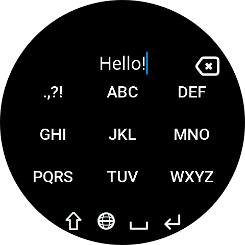
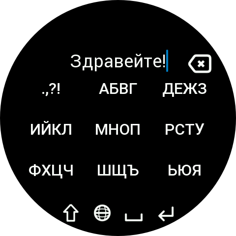

# T9 Greek Keyboard

A Greek and English multi-tap keyboard for Zepp OS.

T9 Greek Keyboard brings a classic mobile phone-style typing experience to compatible Amazfit devices. Letters are grouped on 9 keys and selected by repeatedly tapping the corresponding key.

The keyboard supports Bulgarian and English, Shift, Caps Lock, numbers, symbols, and switching to other Zepp OS input methods.

## Features

- GR Greek multi-tap layout
- 🇬🇧 English multi-tap layout
- Classic 9-key typing
- Shift for a single uppercase letter
- Caps Lock (longpress Shift Button to activate it)
- Additional symbols (.,?!/@€-_)
- Numbers 0–9
- Quick Greek / English switching
- Access to other installed Zepp OS keyboards (longpress globe icon)
- Change typing speed (hold X or ✓ keys)
- Support for round and square displays
- Shift enabled by default on startup

## Keyboard Layout

### Greek

| Key | Characters |
|-----|------------|
| 1 | . , ? ! |
| 2 | А Б В Г |
| 3 | Д Е Ж З |
| 4 | И Й К Л |
| 5 | М Н О П |
| 6 | Р С Т У |
| 7 | Ф Х Ц Ч |
| 8 | Ш Щ Ъ |
| 9 | Ь Ю Я |
| 0 | Space (hold) |

### English

| Key | Characters |
|-----|------------|
| 1 | . , ? ! |
| 2 | A B C |
| 3 | D E F |
| 4 | G H I |
| 5 | J K L |
| 6 | M N O |
| 7 | P Q R S |
| 8 | T U V |
| 9 | W X Y Z |
| 0 | Space (hold) |

Repeatedly tap a key to cycle through its characters.

For example:

`A → B → C`

or in Greek:

`А → Б → В → Г`

## Shift and Caps Lock

**Tap Shift**

Enables Shift for the next character.

On the punctuation key, Shift provides additional symbols:

`@ € - _`

**Hold Shift**

Enables Caps Lock.

Tap Shift again to disable it.

## Numbers

Hold one of the character keys to enter its corresponding number:

`1 2 3 4 5 6 7 8 9`

Hold the **Space** key to enter:

`0`

## Language Switching

**Tap the Globe button**

Switches between the built-in Greek and English layouts:

`BG ↔ EN`

**Hold the Globe button**

Opens the Zepp OS input method selector, allowing you to switch to another installed keyboard.

**Hold Cancel or Enter button**
- Change the time for the chosen letter to commit with the following options:
- Very fast: 200ms, Fast: 400ms, Normal: 600ms, Slow: 800ms, Very slow: 1000ms

## Delete

Tap Delete to remove the previous character.

A character that is still being selected with multi-tap can also be deleted before it is committed.

Hold Delete to clear the input.

## Supported Devices

T9 BG Keyboard is designed for Zepp OS devices supporting third-party input methods.

The interface includes layouts for:

- Round displays
- Square displays

Development and testing are primarily focused on 480×480 round devices, 390x450 square devices and Bip Max
Tested on real Balance 2 and emulators for the other models

## Requirements

- Zepp OS with third-party keyboard / data-widget support
- API Level 4.0 or newer

## Installation

The keyboard is implemented as a Zepp OS data widget.

After installation, enable T9 BG Keyboard from the keyboard/input method settings on your watch.

## Development

The project is built using the Zepp OS SDK.

The keyboard is registered as a `data-widget` and uses the Zepp OS keyboard APIs for text input, composition, function keys, and input-method switching.

## License

See the repository license for details.

## Screenshots

