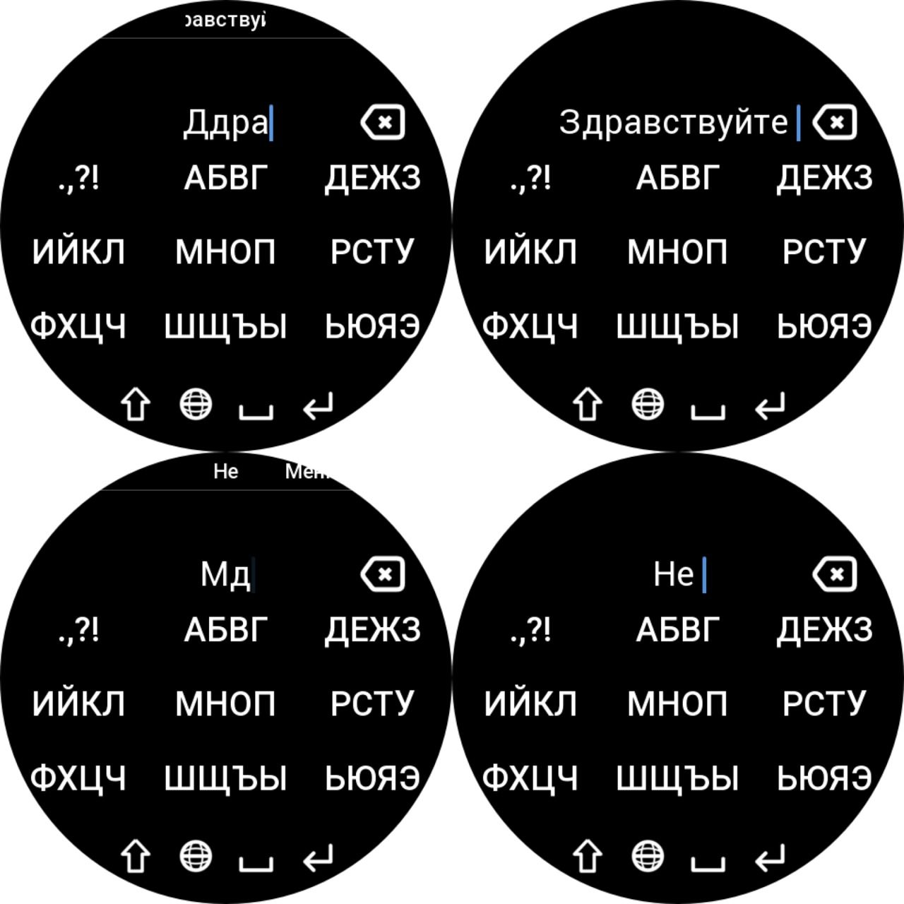

# T9 Russian Keyboard

Клавиатура для устройств Amazfit на Zepp OS, поддерживающая два способа ввода текста: **T9 с предсказанием слов** и **Multi-tap с многократным нажатием клавиш**.

Клавиатура поддерживает русский и английский языки. В режиме T9 последовательность нажатий используется для поиска подходящих слов в пользовательском словаре. Клавиатура автоматически запоминает слова, которые вводит пользователь, и постепенно адаптируется к его стилю общения.

Multi-tap позволяет выбирать отдельные буквы последовательными нажатиями цифровых клавиш.

## Возможности

- 🇷🇺 Русская раскладка с поддержкой T9 и Multi-tap.
- 🇬🇧 Английская раскладка с поддержкой T9 и Multi-tap.
- Автоматическое обучение пользовательского словаря.
- Отдельный пользовательский словарь для каждого языка.
- Панель предсказаний с отображением до пяти вариантов.
- Классический ввод текста с помощью девяти цифровых клавиш.
- Поддержка русской буквы `ё`.
- Shift для ввода одной заглавной буквы.
- Caps Lock, активируемый долгим нажатием Shift.
- Ввод цифр от 0 до 9.
- Пунктуация и дополнительные символы.
- Быстрое переключение между русской и английской раскладками.
- Переключение на другие установленные методы ввода Zepp OS.
- Настройка скорости Multi-tap.
- Поддержка круглых и квадратных экранов.

## T9 и Multi-tap: в чём разница

### T9 — предсказание слов

В режиме T9 для каждой буквы нажимают соответствующую цифровую клавишу один раз. Клавиатура преобразует последовательность нажатий в комбинацию цифр и ищет подходящие слова в пользовательском словаре.

Найденные варианты отображаются на панели предсказаний. Пользователь может выбрать подходящее слово, не вводя каждую букву отдельно.

В отличие от клавиатур с заранее подготовленными словарями, T9 Russian Keyboard формирует словарь на основе слов, которые вводит сам пользователь.

### Multi-tap — многократное нажатие

В режиме Multi-tap одна цифровая клавиша соответствует группе букв. Для выбора нужной буквы соответствующую клавишу нажимают несколько раз.

Например, на английской раскладке:

`A → B → C`

На русской раскладке:

`А → Б → В → Г`

Multi-tap позволяет вводить конкретные символы, последовательно выбирая их из группы, закреплённой за клавишей.

## Самообучающийся словарь T9

Клавиатура не содержит предварительно заполненных словарей русского и английского языков. Пользователь формирует собственные словари в процессе работы.

Механизм обучения:

- Автоматически сохраняет корректно введённые слова.
- Запоминает слова, выбранные из панели предсказаний.
- Ведёт отдельную статистику использования слов для каждого языка.
- Учитывает частоту использования и время последнего использования слова.
- Сохраняет данные локально на устройстве.

Для каждого языка предусмотрен отдельный пользовательский словарь с ограничением в 500 слов.

Если количество слов превышает установленный лимит, периодическая очистка удаляет наименее используемые и давно не использовавшиеся слова. Очистка выполняется не чаще одного раза в три дня.

Новые слова сохраняются сразу и становятся доступны движку T9 после следующего запуска клавиатуры.

Таким образом, словарь постепенно адаптируется к привычной лексике пользователя без необходимости вручную устанавливать или обновлять готовые словари.

## Раскладка клавиатуры

### Русская

| Клавиша | Символы |
|---|---|
| 1 | . , ? ! |
| 2 | А Б В Г |
| 3 | Д Е Ё Ж З |
| 4 | И Й К Л |
| 5 | М Н О П |
| 6 | Р С Т У |
| 7 | Ф Х Ц Ч |
| 8 | Ш Щ Ъ Ы |
| 9 | Ь Ю Я Э |
| 0 | Пробел; удержание — ввод цифры 0 |

Буквы `Е` и `Ё` относятся к одной группе T9, но сохраняются в словах в соответствии с исходным написанием.

### Английская

| Клавиша | Символы |
|---|---|
| 1 | . , ? ! |
| 2 | A B C |
| 3 | D E F |
| 4 | G H I |
| 5 | J K L |
| 6 | M N O |
| 7 | P Q R S |
| 8 | T U V |
| 9 | W X Y Z |
| 0 | Пробел; удержание — ввод цифры 0 |

Для выбора нужной буквы в режиме Multi-tap нажимайте соответствующую клавишу несколько раз.

## Shift и Caps Lock

### Короткое нажатие Shift

Включает Shift для ввода следующего символа в верхнем регистре.

При использовании клавиши пунктуации Shift открывает дополнительные символы:

`@ ₽ - _`

После ввода следующего символа режим Shift отключается автоматически.

### Долгое нажатие Shift

Включает или отключает Caps Lock.

В режиме Caps Lock все вводимые буквы отображаются в верхнем регистре.

## Ввод цифр

Чтобы ввести цифру, нажмите и удерживайте соответствующую цифровую клавишу:

`1 2 3 4 5 6 7 8 9`

Чтобы ввести цифру `0`, нажмите и удерживайте клавишу пробела.

## Переключение языков и методов ввода

### Короткое нажатие на значок глобуса

Переключает встроенные русскую и английскую раскладки:

`RU ↔ EN`

### Долгое нажатие на значок глобуса

Открывает системный селектор методов ввода Zepp OS, позволяя переключиться на другую установленную клавиатуру.

## Настройка скорости Multi-tap

Долгое нажатие кнопки `✓` открывает настройку скорости Multi-tap.

Доступны следующие значения:

| Скорость | Интервал |
|---|---:|
| Очень быстро | 200 мс |
| Быстро | 400 мс |
| Нормально | 600 мс |
| Медленно | 800 мс |
| Очень медленно | 1000 мс |

Выбранная скорость сохраняется локально и используется при последующем вводе текста.

## Удаление символов

Короткое нажатие кнопки удаления удаляет предыдущий символ.

Символ, который ещё выбирается последовательными нажатиями в режиме Multi-tap, также можно удалить до завершения ввода.

**Долгое нажатие кнопки удаления** полностью очищает введённый текст.

## Поддерживаемые устройства

T9 Russian Keyboard предназначена для устройств Zepp OS с поддержкой сторонних методов ввода.

Интерфейс адаптирован для:

- Круглых экранов.
- Квадратных экранов.

Разработка и тестирование в основном ориентированы на устройства с круглыми экранами 480 × 480, квадратными экранами 390 × 450, а также Bip Max.

Клавиатура протестирована на реальном **Amazfit Balance 2** и в эмуляторах других моделей.

## Требования

- Zepp OS с поддержкой сторонних клавиатур и `data-widget`.
- API Level 4.2 или выше.

## Установка

Клавиатура реализована в виде модуля `data-widget` для Zepp OS.

После установки включите **T9 Russian Keyboard** в настройках клавиатуры или методов ввода на часах.

## Язык приложения

- Русский.
- Английский.

## Разработка

Проект разработан с использованием Zepp OS SDK.

Клавиатура зарегистрирована как `data-widget` и использует API клавиатуры Zepp OS для ввода текста, формирования символов, обработки функциональных клавиш и переключения методов ввода.

Для предсказания слов используется движок T9 с отдельными пользовательскими словарями для русского и английского языков. Словари формируются автоматически по мере использования клавиатуры и сохраняются в локальном хранилище устройства.

## Лицензия

Подробную информацию см. в файле лицензии репозитория.

## Скриншоты

